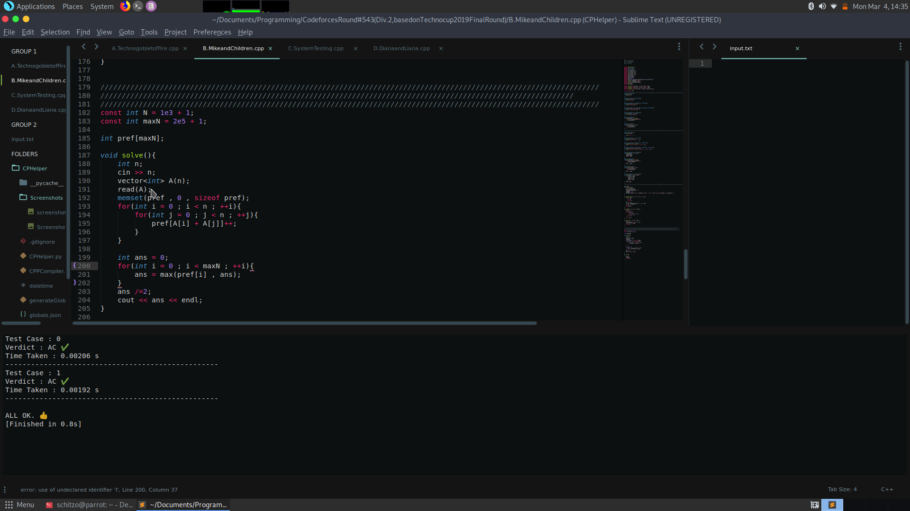
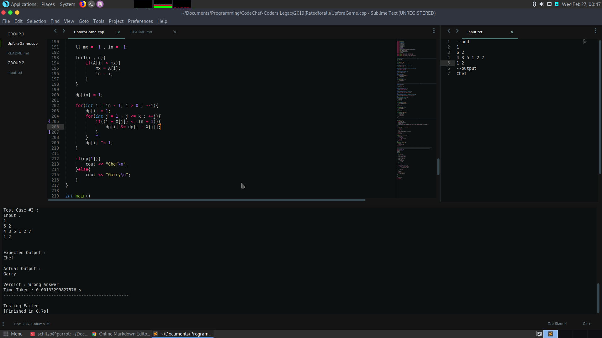

# CP Helper
A tool for competitive programming in sublime text.
This tool uses competitve companion to get the parsed data of a competitve coding problem and saves it in a json file in the contest folder. The build which is used to compile a C++ code instead of compiling and running calls a python file which compiles your code then uses the sample test cases from the contest page (which is stored in the json file) and validates your codes output with the expected output.
All you have to do is click on the competitive companion plug-in when a problem page and the start coding. Run your code and it will automatically check your code's output for the sample test cases given in the problem. You can also add and check with your custom test cases using the input.txt file.

# How to set it up?
- Install [Competitive Companion](https://chrome.google.com/webstore/detail/competitive-companion/cjnmckjndlpiamhfimnnjmnckgghkjbl) plugin for Chrome and add port 7175 in its custom port settings.
- Clone this repository.
- Create a new build system in sublime text and copy paste the following. Then save it.
```
{
    "shell_cmd": "g++ \"${file}\" -o \"${file_path}/${file_base_name}\"",
    "file_regex": "^(..[^:]*):([0-9]+):?([0-9]+)?:? (.*)$",
    "working_dir": "${file_path}",
    "selector": "source.c, source.c++",
    "variants":
    [
        {
            "name": "Run",
            "shell_cmd": "timeout 3s python {Path where you cloned this repo}/CPHelper/Main.py \"${file_path}/${file_base_name}\""
        }
    ]
}
```
- In generateGlobalJson.py change the TEMPLATE and baseContestPath according to your needs and run it to generate the globals.json file.
- Run CPHelper.py in the CPHelper directory.(And leave it running)
- When on a problem page click on the Competitive Companion plugin, it will parse the task data and open sublime text with your template.
- Write the code. Build and run using the new build system you made and you are good to go.
- For checking with custom test cases create a input.txt file and change inputTxtPath in generateGlobalJson.py, run it to change the globals.json.
# input.txt
In this file you can enter a test case and it will be checked allong with the sample test cases of the problem.
To specify the correct output of this test case use --output. It will validate this test case with the provided output.
Example - 
```
4
2 4 5 7
--output
18
```
You can also use --add to add this test case to the set of sample test cases which are always checked.
Example - 
```
--add
4
2 4 5 7
--output
18
```
# To-Do
- Add testing of a task using brute force code and test case generator.
- Add special case for interactive problems.

# Screenshots



